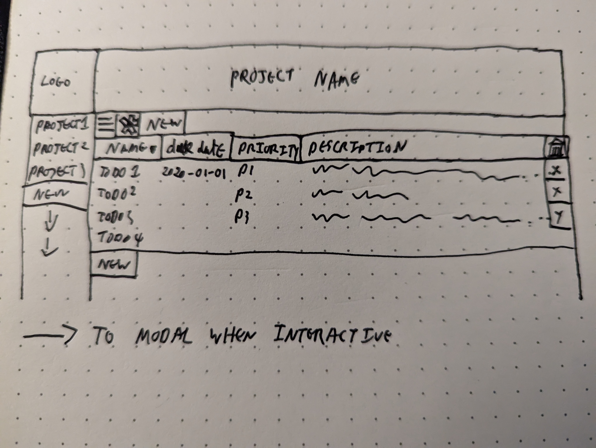

# odin-todo-project
A classic TODO app making use of webpack, more complex JavaScript and local storage

# Links
- [Project](https://anevilpenguin.github.io/odin-todo-project)
- [Assignment Brief](https://www.theodinproject.com/lessons/node-path-javascript-todo-list)

## Project Synopsis

Mostly a chance to solidify existing techniques. However there are some new 
concepts coming in with local storage.

## Learning Objectives

- Solidify existing concepts into a classic web showcase
- Learn about local storage
- Build a page using JavaScript DOM manipulation
  - Specifically using good well designed code
- EP wanted to use more GitHub actions

## Basic Plan

